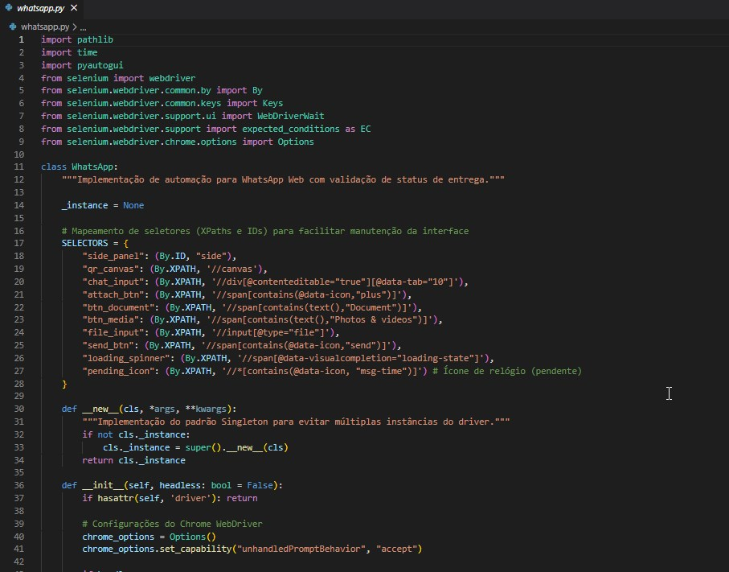

# 🚀 WhatsApp Web Automation (Selenium)

Este projeto consiste em uma classe robusta em Python para automação de envios de mensagens, documentos e mídias através do **WhatsApp Web**. A implementação utiliza **Selenium WebDriver** e foca na estabilidade do fluxo de envio e integridade dos arquivos.

<p align="center">
  
</p>

## 🧠 Diferenciais Técnicos

### Tratamento de Mídia vs. Documento
Embora o WhatsApp Web utilize um elemento de `input[@type="file"]` comum para uploads, este script separa os fluxos de envio:
- **Modo Mídia:** Aciona o seletor de "Fotos e Vídeos", garantindo que o WhatsApp processe o buffer para visualização rápida.
- **Modo Documento:** Aciona o seletor de "Documento", garantindo a integridade do arquivo original. Isso evita que imagens de alta resolução sejam comprimidas ou convertidas indevidamente em stickers pela inteligência da plataforma.

### Verificação de Fluxo de Saída (Delivery Check)
Diferente de automações simples que apenas disparam o clique, este módulo realiza um polling no DOM em busca do ícone `msg-time` (pendente). O script só libera a próxima tarefa quando confirma que a mensagem foi processada pelo servidor, garantindo que nenhum dado seja perdido em conexões instáveis.

---

## 🛠️ Tecnologias Utilizadas

- **Python 3.x**
- **Selenium**: Automação do navegador.
- **PyAutoGUI**: Manipulação de janelas de diálogo do sistema operacional.

## 📋 Pré-requisitos & Instalação

1. Clone o repositório:
   ```bash
   git clone [https://github.com/lucasfagundess/whatsapp-web-automation.git](https://github.com/lucasfagundess/whatsapp-web-automation.git)


2. Instale as dependências:

pip install -r requirements.txt


🔧 Como Usar
O projeto utiliza o padrão Singleton e mantém a sessão ativa através de um diretório de perfil local (chrome-data), evitando a necessidade de ler o QR Code em cada execução.

from whatsapp import WhatsApp

# Inicializa o bot (headless=False para ver o navegador)
bot = WhatsApp(headless=False)

# Envio de texto puro
bot.send_text("5551999999999", "Olá! Mensagem automática.")

# Envio de mídia (Foto/Vídeo)
bot.send_media("5551999999999", "caminho/da/imagem.png", "Legenda da foto")

bot.close()


⚠️ Disclaimer
Este código foi desenvolvido para fins de estudo e automação de notificações. O uso para disparos em massa (spam) pode resultar no banimento da conta. Utilize com responsabilidade.

---
